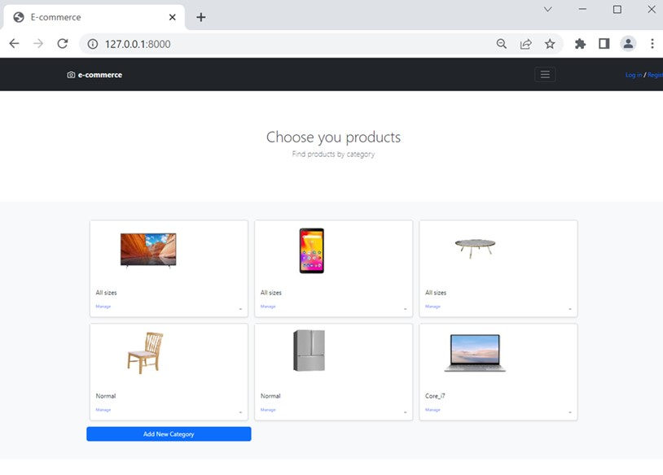
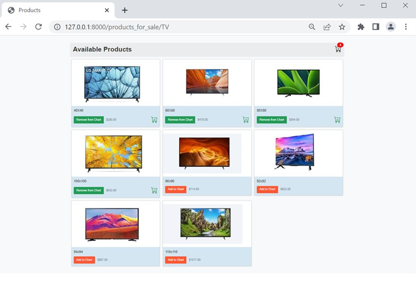
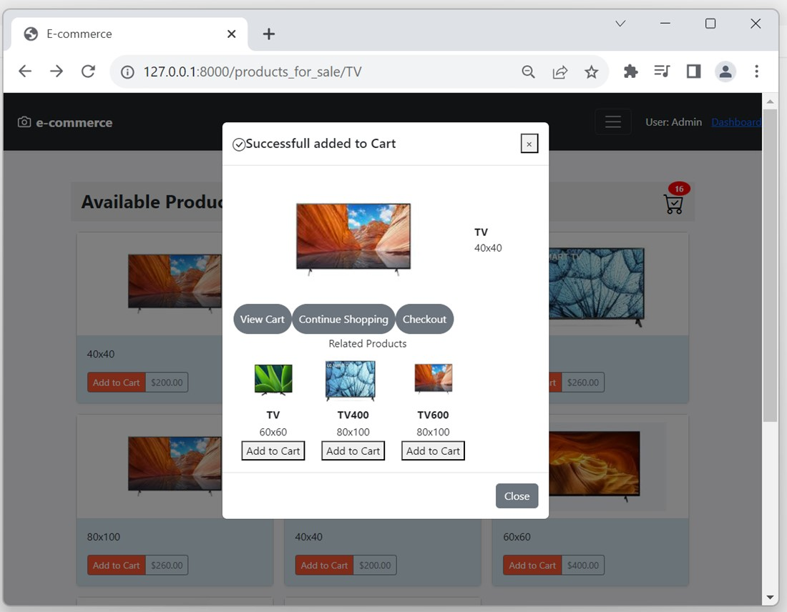
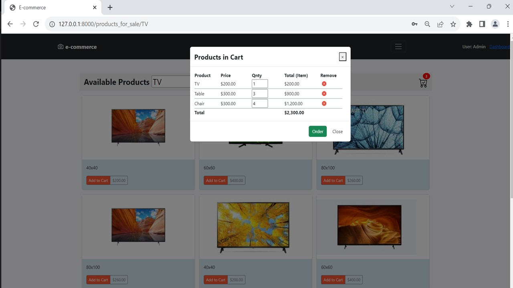
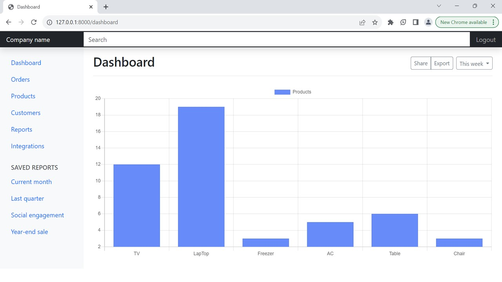

# E-Commerce Webpage
This project aim to demostrate how E-Commerce webpage can be developed using Python + Django

Products in TV category. Adding products to Chart

Highlighting Product

Products in Chart

Add or edit product

Dashboar for Managers

## To run the project

Type in commandline

### `py manage.py runserver`

Server will run on [http://127.0.0.1:8000]